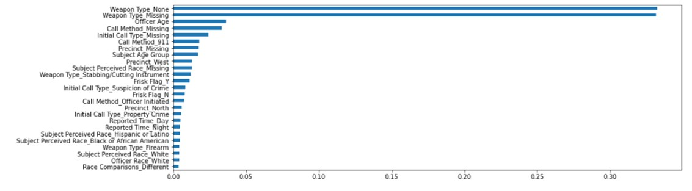
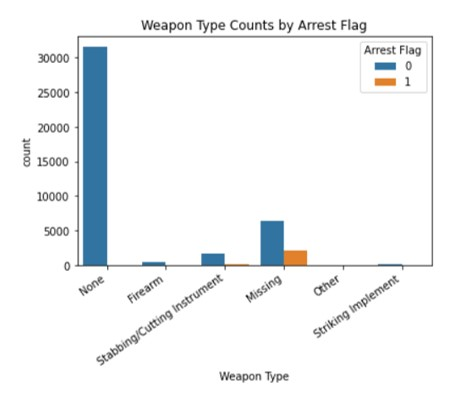
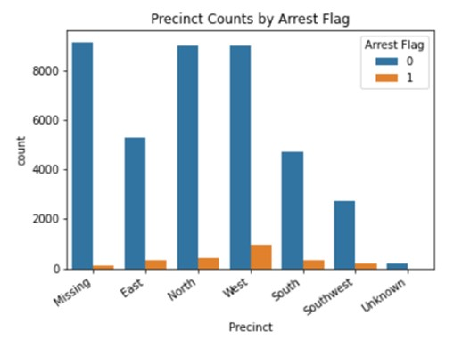
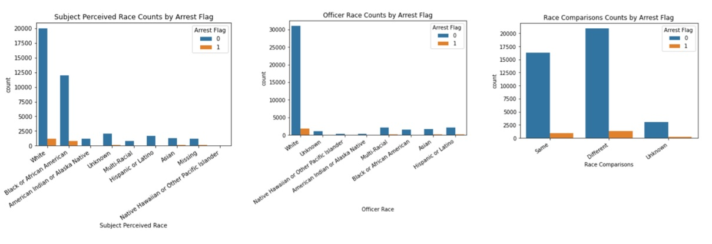
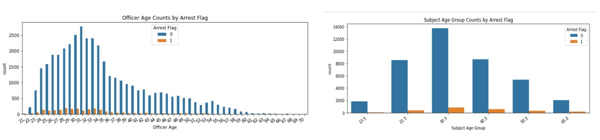

# Module 3 Final Project
## Variables Affecting Terry Stops 

Terry Stops, also known as stop and frisk, were allowed by the Supreme Court case Terry v. Ohio in 1968. This case allows police officers to stop and detain an individual they reasonably suspect of having committed, currently committing, or about to commit a crime. In this interaction, they are allowed to pat down, aka frisk, the stopped party. Terry stops are stops that are not based on probable cause, but during the stop probable cause can be found and lead to an arrest. It is worth noting that this practice has been challenged, both by individuals and in court cases, for being disproportionately targeted towards Black and Latinx individuals.

The goal of this project was to predict whether a Terry stop lead to an arrest based on variables about the officer, subject, and the content of the stop. Logistic regression, decision trees, and random forest models were tried and compared to generate the best balanced of correctly identifying arrests and non-arrests. While precision and f1 scores were low for all models, the random forest and logistic regression models performed well on AUC and recall. Despite the higher recall score for arrest in the logistic regression, the slightly higher accuracy of the model and better precision and f1 scores for arrests designated the random forest as the best performing model.

## Business Problem

The insights provided by this model can be used to figure out the important factors in making Terry Stops and indicate areas where improvements could be made.

## Data

This project uses Seattle Police Department's Terry Stop data from 2015-2020.  The data is found in this repository and at https://catalog.data.gov/dataset/terry-stops. 

## Methods

The data were analyzed using logistic regression, decision trees, and random forests. The goal was to balance accuracy, auc, f1-score, precision, and recall. Then feature importance was analyzed. The top 25 features were considered.   

## Results

The random forest model with modified hyperparameters provided the best balance of metrics and was 88% accurate.  

The model correctly predicted arrests 84% of the time and non-arrests 89% of the time. 

Missing data was important for many categories. Other important categories included precinct, weapon type, race, and age. 

Having no weapon was associated with few arrests as would be expected. However having a firearm or stabbing instrument had lower rates of arrest than other types of weapons. Missing values were also important for this category.

Once again missing data was important. West Precinct had a higher proportion of arrests while the North Precinct had lower rates. All three had high rates of stops.

White and African American/Black individuals had the highest rates of stops and arrests. Hispanic/Latino individuals had very low rates. Missing data played a role in this category. The officer's race being White was the only officer level race variable the be listed as imporant. Having an officer and subject of differt races also had the highest rates of stops and arrests.  

Arrests and stops were related to lower age for both officers and subjects. As far as officers, this may be reflective of their job responsibilities. 

## Recomendations
The cause of missing data should be investigated in the future. In addition precise data about stop location was not available and might provide useful information. Clearly race should not be a significant factor in Terry Stops so this must be addressed by police departments such as Seattle's where this is an important determinent in models of Terry Stop arrests. The discrepancies in precinct and officer/subject age should be studied further.

## Limitations

The precision and f1-score for arrests in this model were still quite low. In addition the amount of missing data may have influenced the results. The data cleaning process involved categorizing a wide swath of data and those choices may have limited the model's effectiveness. In addition, a more complex model could possibly have been used to get better results.